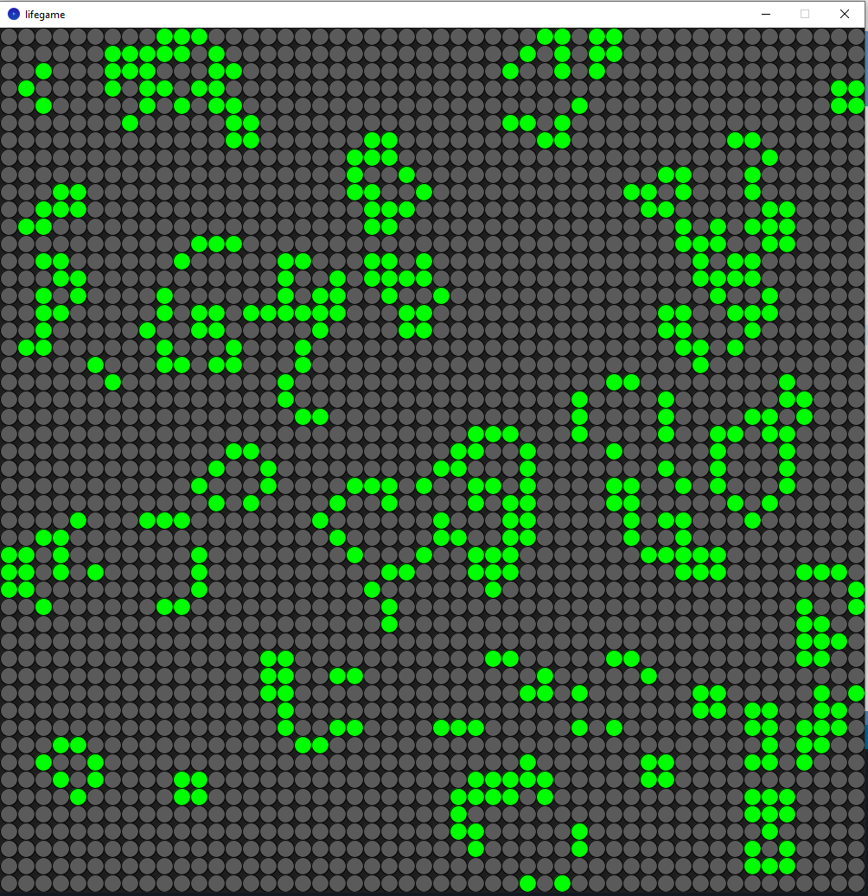

# life
The Game of Life, also known simply as Life, is a cellular automaton devised by the British mathematician John Horton Conway in 1970. The code I wrote in Python mode for Processing.

The game written just for fun. Enjoy! :)

## usage
The game started at pause state. So you can set some cells on the field to alive state by mouse click. Then press '1' key to start the game.

Or you can fill the field with random values (press '2' key). And then start the game by pressing '1'.

The keys:
- 1 - start/pause the game
- 2 - fill the field with random values
- mouse click on the field - set cell to alive state

